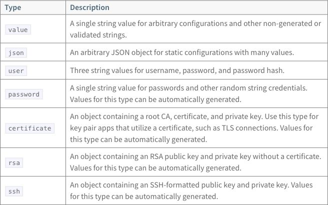
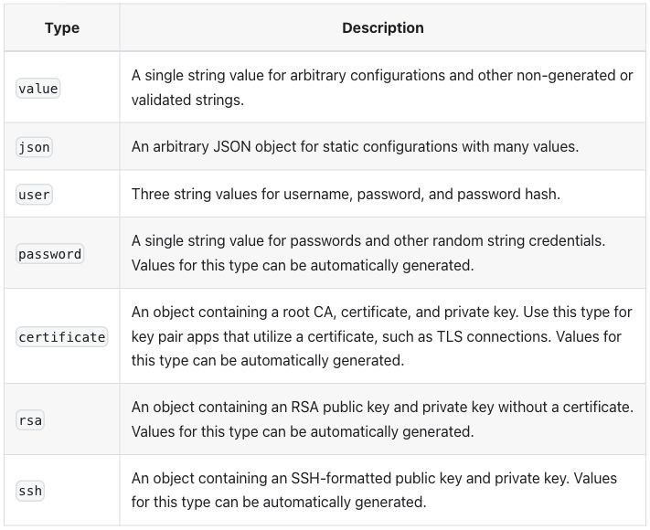
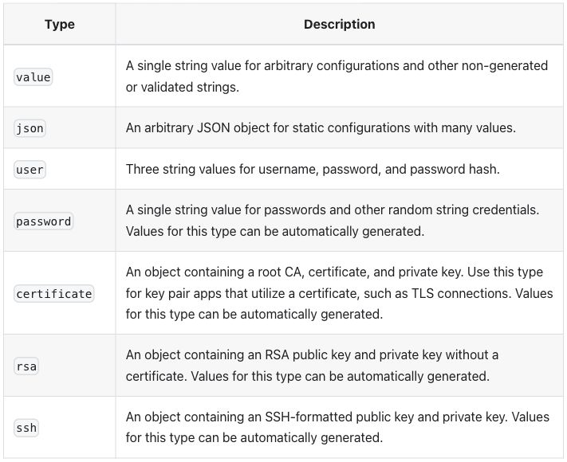
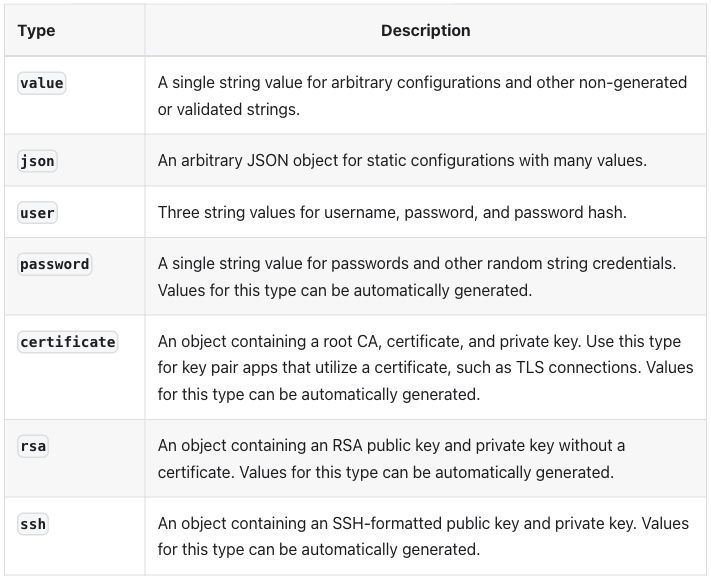
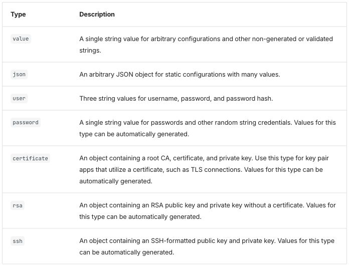
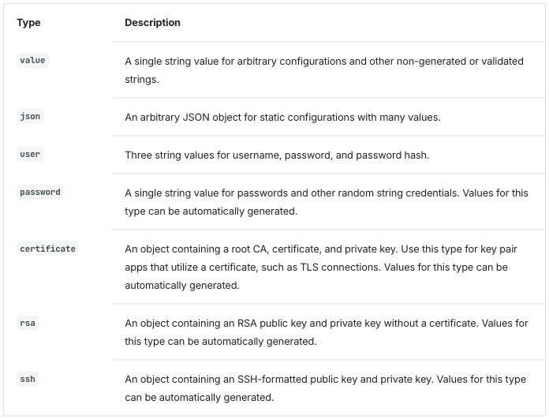
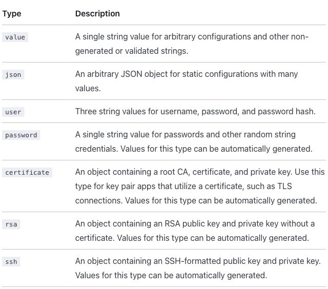
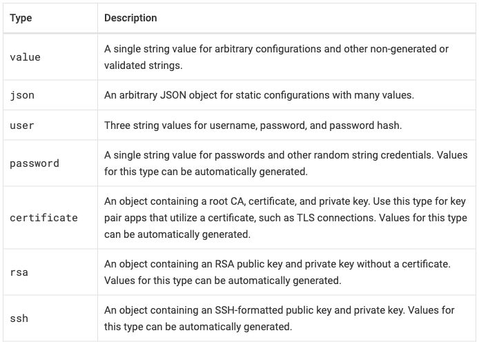
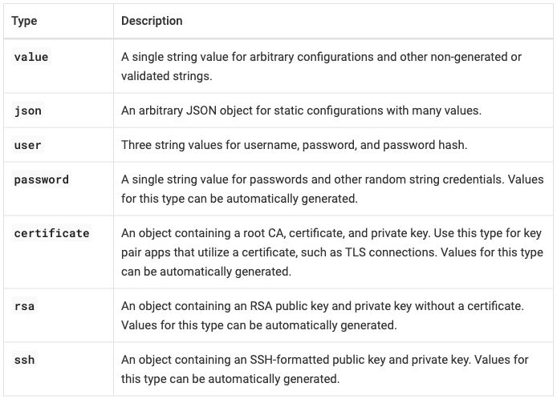

# Tables: input and output, page by page

Status: draft, incomplete — covers what is known as of 2026-10-10.

This file puts each test page's tables next to what the candidate tools
made of them. For each page: the table as published on docs.cloudfoundry.org
today, the text an author writes in each tool, and the page that tool builds
from it. The *test pages* are five pages the Docs WG lead picked because
their tables are hard to express outside HTML, plus one page added later
(see the [glossary](../glossary.md#test-pages)). How the work was done is in
the [README](README.md); the full grids and measurements are in
[results.md](../concepts/tables/results.md).

How to read the comparisons:

- **Modes.** Each page was converted by hand in up to four ways (see the
  [glossary](../glossary.md#mode) for more). *Passthrough* keeps the page's
  HTML as written, with only the changes a tool forces. *Native* uses the
  tool's own table syntax and whatever width or alignment settings that syntax
  offers. *Native-plain* is native with no width or alignment settings.
  *Extension* writes the table in a list-like syntax (one cell per line)
  and adds options for what the table asks for, such as row headers and
  key columns that do not wrap; a small piece of code or CSS added to the
  site once, such as a plugin or a custom block, gives those options their
  effect. This file shows native, passthrough and extension; native-plain
  is linked.
- **Hints.** What a table asks for, independent of any tool: a column's
  width, whether it should avoid wrapping, whether the first column labels
  its row (a *row header*), and so on. Widths are hints, not exact values
  ([R-03](../requirements/README.md#r-03) column widths as hints; requirement IDs are listed in
  [requirements](../requirements/README.md)).
- **Screenshots.** Taken in a browser with a 1280-pixel window, each tool
  using its default *theme* (the fonts, colors, borders and spacing a tool
  ships with). Colors and fonts belong to the theme and are not compared;
  what is compared is content, structure and the hints.

## `_oss_scale_table`

- Published: not a page of its own. It is a *partial* (a file of shared
  content included into other pages), included by the `high-availability`
  page, <https://docs.cloudfoundry.org/concepts/high-availability.html>
  ([include line](https://github.com/cloudfoundry/docs-cloudfoundry-concepts/blob/4ac2fb19a0a44534a8469de100af7dd91706e9b7/high-availability.html.md.erb#L108) in the host page's source).
- Upstream source: [`_oss_scale_table.html.md.erb` in cloudfoundry/docs-cloudfoundry-concepts, commit `4ac2fb1`](https://github.com/cloudfoundry/docs-cloudfoundry-concepts/blob/4ac2fb19a0a44534a8469de100af7dd91706e9b7/_oss_scale_table.html.md.erb)
- Snapshot: [source/_oss_scale_table.html.md.erb](../concepts/tables/source/_oss_scale_table.html.md.erb) in this repo
  is a copy of that file at that commit. The per-tool versions are
  modified from it. Details: [SOURCES.md](../concepts/tables/source/SOURCES.md).

The partial, from docs-cloudfoundry-concepts, holds one table:
Component / Total Instances / Notes. The source sets widths 25/25/50. The
key column's longest entry, "Cloud Controller Worker", pushes against its
25% in the tools where the no-wrap hint wins.

- Intent and spot checks: [intent/_oss_scale_table.md](../concepts/tables/intent/_oss_scale_table.md)
- Results per tool: [Docusaurus](../concepts/tables/results.md#docusaurus-3102),
  [Zensical](../concepts/tables/results.md#zensical-0069),
  [Starlight](../concepts/tables/results.md#starlight-0426),
  [Antora](../concepts/tables/results.md#antora-321)

**Not yet written:** the published screenshot, each tool's native and
passthrough input, the output screenshots, and the differences seen, as in
[`credential-types`](#credential-types).

## `credential-types`

- Published: <https://docs.cloudfoundry.org/credhub/credential-types.html>
- Upstream source: [`credential-types.html.md.erb` in cloudfoundry/docs-credhub, commit `e074f74`](https://github.com/cloudfoundry/docs-credhub/blob/e074f74717422c0082ca24a2a6da7fbbf8114999/credential-types.html.md.erb)
- Snapshot: [source/credential-types.html.md.erb](../concepts/tables/source/credential-types.html.md.erb) in this repo
  is a copy of that file at that commit. The per-tool versions are
  modified from it. Details: [SOURCES.md](../concepts/tables/source/SOURCES.md).

From docs-credhub, one table: Type / Description, seven rows, one per CredHub
credential type ([intent](../concepts/tables/intent/credential-types.md)).

What the table asks for ([R-02](../requirements/README.md#r-02) rich tables):

- Column 1 about 20% wide. The source writes it as `<th style="width:20%">`.
- Column 1 names the type, so it is a *key* column (short identifiers that
  should not wrap) and could be row headers. Column 2 is *prose*.
- The source writes the class with typographic quotes, `class=“table”`.
  Browsers read that as a class named `“table”`, quotes included (a
  typographic quote is not an attribute quote, so the value is an
  [unquoted attribute value](https://html.spec.whatwg.org/multipage/syntax.html#unquoted)),
  so the published page never applied the `table` class. Every conversion makes the
  quotes straight first ([R-24](../requirements/README.md#r-24) markup cleanup before conversion), so
  `class="table"` names the standard table style ([R-09](../requirements/README.md#r-09) table styles by
  class).

At a glance, from the screenshots below. Column 1 widths are the measured
values in [results.md](../concepts/tables/results.md), percent of the table:

| Output | Column 1 width | Header cells | Body cells, vertically | Type cells as row headers | Rule between the columns |
|---|---|---|---|---|---|
| Published | 20% | left | centered | no | yes |
| Docusaurus native | 18%, sized by content | centered | centered | no | yes |
| Docusaurus passthrough | 20% | centered | centered | no | yes |
| Zensical native and passthrough | 20% | left | top | no | no |
| Starlight native and passthrough | 20% | left | top | no | no |
| Antora native | 20% | left | top | yes (bold) | yes |
| Antora passthrough | 20% | left | centered | no | yes |
| Docusaurus extension | 20% | "Type" left, "Description" centered | top | yes (bold) | yes |
| Zensical extension | 20% | left | top | yes (bold) | no |
| Starlight extension | 20% | left | top | yes (bold) | no |
| Antora extension | 20% | left | top | yes (bold) | yes |

All seven rows and both columns are present in every output, and every type
name renders as code: the spot checks (per-table checks listed in the intent
file and run on every build) pass in every mode of every tool.

### Published



Column 1 is 20% of the table. Header cells are on the left. A type name sits
in the vertical middle of its row when the description takes two or three
lines. Every cell has a border.

<details><summary>Source as written (HTML in an ERB page; note the typographic quotes on the class)</summary>

```html
<table class=“table”>
<thead>
  <tr>
    <th style="width:20%">Type</th>
    <th>Description</th>
  </tr>
  </thead>
  <tr>
    <td><code>value</code></td>
    <td>A single string value for arbitrary configurations and other non-generated or validated strings.</td>
  </tr><tr>
    <td><code>json</code></td>
    <td>An arbitrary JSON object for static configurations with many values.</td>
  </tr><tr>
    <td><code>user</code></td>
    <td>Three string values for username, password, and password hash.</td>
  </tr><tr>
    <td><code>password</code></td>
    <td>A single string value for passwords and other random string credentials. Values for this type can be automatically generated.</td>
  </tr><tr>
    <td><code>certificate</code></td>
    <td>An object containing a root CA, certificate, and private key. Use this type for key pair apps that utilize a certificate, such as TLS connections. Values for this type can be automatically generated.</td>
  </tr><tr>
    <td><code>rsa</code></td>
    <td>An object containing an RSA public key and private key without a certificate. Values for this type can be automatically generated.</td>
  </tr><tr>
    <td><code>ssh</code></td>
    <td>An object containing an SSH-formatted public key and private key. Values for this type can be automatically generated.</td>
  </tr>
</table>
```

</details>

ERB (Embedded Ruby, `<%= … %>` tags in a page; see the
[glossary](../glossary.md#erb)) is how today's pages insert variables and
partials. This table uses neither.

### Docusaurus 3.10.2

Pages are MDX: Markdown that also accepts JSX, the HTML-like syntax of
React components (see the [glossary](../glossary.md#mdx)). MDX parses HTML
as JSX, which is stricter than a browser (the MDX project's own
[documentation](https://github.com/mdx-js/mdx/blob/52285a6758fa078ec57f3d4bd8803d9cbfb12065/docs/docs/what-is-mdx.mdx#L165-L171)).

<details><summary>Native input: a pipe table in MDX</summary>

```markdown
| Type | Description |
| --- | --- |
| `value` | A single string value for arbitrary configurations and other non-generated or validated strings. |
| `json` | An arbitrary JSON object for static configurations with many values. |
| `user` | Three string values for username, password, and password hash. |
| `password` | A single string value for passwords and other random string credentials. Values for this type can be automatically generated. |
| `certificate` | An object containing a root CA, certificate, and private key. Use this type for key pair apps that utilize a certificate, such as TLS connections. Values for this type can be automatically generated. |
| `rsa` | An object containing an RSA public key and private key without a certificate. Values for this type can be automatically generated. |
| `ssh` | An object containing an SSH-formatted public key and private key. Values for this type can be automatically generated. |
```

</details>

<details><summary>Passthrough input: the HTML written as JSX (style object, added tbody)</summary>

```jsx
<table class="table">
<thead>
  <tr>
    <th style={{width: '20%'}}>Type</th>
    <th>Description</th>
  </tr>
  </thead>
  <tbody>
<tr>
    <td><code>value</code></td>
    <td>A single string value for arbitrary configurations and other non-generated or validated strings.</td>
  </tr><tr>
    <td><code>json</code></td>
    <td>An arbitrary JSON object for static configurations with many values.</td>
  </tr><tr>
    <td><code>user</code></td>
    <td>Three string values for username, password, and password hash.</td>
  </tr><tr>
    <td><code>password</code></td>
    <td>A single string value for passwords and other random string credentials. Values for this type can be automatically generated.</td>
  </tr><tr>
    <td><code>certificate</code></td>
    <td>An object containing a root CA, certificate, and private key. Use this type for key pair apps that utilize a certificate, such as TLS connections. Values for this type can be automatically generated.</td>
  </tr><tr>
    <td><code>rsa</code></td>
    <td>An object containing an RSA public key and private key without a certificate. Values for this type can be automatically generated.</td>
  </tr><tr>
    <td><code>ssh</code></td>
    <td>An object containing an SSH-formatted public key and private key. Values for this type can be automatically generated.</td>
  </tr>
</tbody>

</table>
```

</details>

Files: [native](../concepts/tables/sites/docusaurus/docs/native/credential-types.mdx),
[passthrough](../concepts/tables/sites/docusaurus/docs/passthrough/credential-types.mdx),
[passthrough as written](../concepts/tables/sites/docusaurus/docs/passthrough-raw/credential-types.mdx),
[extension](../concepts/tables/sites/docusaurus/docs/extension/credential-types.mdx).
Docusaurus has no native-plain page: its native page already has no width
settings.

**Native output:**



**Passthrough output:**



Differences seen:

- **The page does not build with the HTML as written.** MDX stops at the
  `“` before the class value. Passthrough also needed `style` written as a
  JSX object (`style={{width: '20%'}}`) and the rows wrapped in `<tbody>`
  ([R-24](../requirements/README.md#r-24) markup cleanup before conversion;
  [raw passthrough errors](../concepts/tables/results.md#raw-passthrough-errors)).
- **Native has no column width.** A pipe table (a Markdown table written with
  `|` between cells; see the [glossary](../glossary.md#pipe-table)) carries
  no widths, so column 1 is sized by its content, 18% here. Passthrough keeps
  the 20%.
- **Header cells are centered**, in both modes; the published page has them
  on the left.
- **Alternate body rows are shaded** (`json`, `password`, `rsa`), in both
  modes. The published table has no shading.
- Body cells are vertically centered, as on the published page. No row
  headers in either mode.

Both modes use no plugin: native is MDX's own pipe table, passthrough is
HTML written as JSX inside MDX.

**Extension mode.** A `:::list-table` block, read by a remark plugin
(remark is the Markdown parser under MDX:
[`@mdx-js/mdx` dependencies](https://github.com/mdx-js/mdx/blob/52285a6758fa078ec57f3d4bd8803d9cbfb12065/packages/mdx/package.json#L62-L64)) added to the site:
[plugins/list-table.js](../concepts/tables/sites/docusaurus/plugins/list-table.js),
with [hints.css](../concepts/tables/sites/docusaurus/src/css/hints.css).

<details><summary>Extension input: a list-table directive</summary>

```markdown
:::list-table{widths="20 auto" header-rows="1" stub-columns="1" roles="key prose"}
- - Type
  - Description
- - `value`
  - A single string value for arbitrary configurations and other non-generated or validated strings.
- - `json`
  - An arbitrary JSON object for static configurations with many values.
- - `user`
  - Three string values for username, password, and password hash.
- - `password`
  - A single string value for passwords and other random string credentials. Values for this type can be automatically generated.
- - `certificate`
  - An object containing a root CA, certificate, and private key. Use this type for key pair apps that utilize a certificate, such as TLS connections. Values for this type can be automatically generated.
- - `rsa`
  - An object containing an RSA public key and private key without a certificate. Values for this type can be automatically generated.
- - `ssh`
  - An object containing an SSH-formatted public key and private key. Values for this type can be automatically generated.
:::
```

`widths` sets column 1 to 20% and sizes column 2 by its content,
`header-rows="1"` makes the first row the header, `stub-columns="1"` makes
column 1 row headers, and `roles` names column 1 a key column and column 2
prose.

</details>

**Extension output:**



Differences seen, against the published page and the other two modes:

- **Column 1 is 20%**, as in passthrough.
- **The type cells are row headers**, drawn in bold.
- **Body cells are aligned to the top**; native, passthrough and the
  published page center them.
- **The "Type" header is on the left and "Description" is centered**, so the
  two header cells no longer match. The reason has not been looked into.
- Alternate body rows are still shaded, as in the other two modes.

### Zensical 0.0.69

Pages are Markdown read by Python-Markdown, which passes HTML blocks through
unchanged (see the [glossary](../glossary.md#python-markdown);
[HTML block stash](https://github.com/Python-Markdown/markdown/blob/0bf535bc406c95dad66050f07c8402af03fe07d5/markdown/preprocessors.py#L78-L84)
in Python-Markdown's source). An
*attribute list*, `{: … }` after a cell's text, sets HTML attributes on that
cell
([`attr_list.py`](https://github.com/Python-Markdown/markdown/blob/0bf535bc406c95dad66050f07c8402af03fe07d5/markdown/extensions/attr_list.py#L104-L110)).

<details><summary>Native input: a pipe table with a width on the header cell</summary>

```markdown
| Type {: style="width:20%" } | Description |
| --- | --- |
| `value` | A single string value for arbitrary configurations and other non-generated or validated strings. |
| `json` | An arbitrary JSON object for static configurations with many values. |
| `user` | Three string values for username, password, and password hash. |
| `password` | A single string value for passwords and other random string credentials. Values for this type can be automatically generated. |
| `certificate` | An object containing a root CA, certificate, and private key. Use this type for key pair apps that utilize a certificate, such as TLS connections. Values for this type can be automatically generated. |
| `rsa` | An object containing an RSA public key and private key without a certificate. Values for this type can be automatically generated. |
| `ssh` | An object containing an SSH-formatted public key and private key. Values for this type can be automatically generated. |
```

</details>

<details><summary>Passthrough input: the HTML as written, quotes made straight</summary>

```html
<table class="table">
<thead>
  <tr>
    <th style="width:20%">Type</th>
    <th>Description</th>
  </tr>
  </thead>
  <tr>
    <td><code>value</code></td>
    <td>A single string value for arbitrary configurations and other non-generated or validated strings.</td>
  </tr><tr>
    <td><code>json</code></td>
    <td>An arbitrary JSON object for static configurations with many values.</td>
  </tr><tr>
    <td><code>user</code></td>
    <td>Three string values for username, password, and password hash.</td>
  </tr><tr>
    <td><code>password</code></td>
    <td>A single string value for passwords and other random string credentials. Values for this type can be automatically generated.</td>
  </tr><tr>
    <td><code>certificate</code></td>
    <td>An object containing a root CA, certificate, and private key. Use this type for key pair apps that utilize a certificate, such as TLS connections. Values for this type can be automatically generated.</td>
  </tr><tr>
    <td><code>rsa</code></td>
    <td>An object containing an RSA public key and private key without a certificate. Values for this type can be automatically generated.</td>
  </tr><tr>
    <td><code>ssh</code></td>
    <td>An object containing an SSH-formatted public key and private key. Values for this type can be automatically generated.</td>
  </tr>
</table>
```

</details>

Files: [native](../concepts/tables/sites/zensical/docs/native/credential-types.md),
[native-plain](../concepts/tables/sites/zensical/docs/native-plain/credential-types.md),
[passthrough](../concepts/tables/sites/zensical/docs/passthrough/credential-types.md),
[passthrough as written](../concepts/tables/sites/zensical/docs/passthrough-raw/credential-types.md),
[extension](../concepts/tables/sites/zensical/docs/extension/credential-types.md).

**Native and passthrough output** (the two screenshots are the same image,
byte for byte):



Differences seen:

- **The page builds with the HTML as written.** The only change is the
  straight quotes from the intent file.
- **Column 1 is 20% in both modes.** Native gets it from the attribute on the
  header cell. Without it (native-plain), column 1 is 15%.
- **No rule between the columns.** Rows are separated by horizontal rules
  inside a thin outer frame.
- **Body cells are aligned to the top**; the published page centers them.
- No row headers. The default theme styles only tables without a class, so
  the site's stylesheet gives `table.table` the theme's table look
  ([Zensical finding 1](../concepts/tables/results.md#zensical-0069)); that is
  why the two modes look the same.

**Extension mode.** A `/// list-table` block, read by a Python-Markdown
extension added to the site,
[list_table.py](../concepts/tables/sites/zensical/list_table.py), with
[hints.css](../concepts/tables/sites/zensical/docs/stylesheets/hints.css).

<details><summary>Extension input: a list-table block</summary>

```markdown
/// list-table
    widths: 20 auto
    header-rows: 1
    stub-columns: 1
    roles: key prose

-   - Type
    - Description

-   - `value`
    - A single string value for arbitrary configurations and other non-generated or validated strings.

-   - `json`
    - An arbitrary JSON object for static configurations with many values.

-   - `user`
    - Three string values for username, password, and password hash.

-   - `password`
    - A single string value for passwords and other random string credentials. Values for this type can be automatically generated.

-   - `certificate`
    - An object containing a root CA, certificate, and private key. Use this type for key pair apps that utilize a certificate, such as TLS connections. Values for this type can be automatically generated.

-   - `rsa`
    - An object containing an RSA public key and private key without a certificate. Values for this type can be automatically generated.

-   - `ssh`
    - An object containing an SSH-formatted public key and private key. Values for this type can be automatically generated.
///
```

The options mean the same as in the Docusaurus directive: column 1 at 20%,
a header row, column 1 as row headers, and the column roles.

</details>

**Extension output:**



Differences seen, against native and passthrough:

- **The type names are bold**: they are row headers. Compared pixel by
  pixel with the native screenshot, only the type column differs.
- Column 1 at 20%, cells aligned to the top and no rule between the
  columns, as in the other two modes.

### Starlight 0.42.6

Starlight is a documentation theme for the Astro site builder
([depends on `astro`](https://github.com/withastro/starlight/blob/67de74077524001c79ec233e1b113e86b2b800b0/packages/starlight/package.json#L51)).
These pages are Markdoc, Markdown with `` tags, with HTML allowed (see the
[glossary](../glossary.md#markdoc)). Markdoc's `` tag writes each
cell as a list item and each row break as `---`
([table transform](https://github.com/markdoc/markdoc/blob/df5ac9aae57505eae5e7572aab3dda50d61f434c/src/transforms/table.ts#L41-L86)).

<details><summary>Native input: Markdoc's table tag with a width on the header cell</summary>

```markdown

* Type {% width="20%" %}
* Description
---
* `value`
* A single string value for arbitrary configurations and other non-generated or validated strings.
---
* `json`
* An arbitrary JSON object for static configurations with many values.
---
* `user`
* Three string values for username, password, and password hash.
---
* `password`
* A single string value for passwords and other random string credentials. Values for this type can be automatically generated.
---
* `certificate`
* An object containing a root CA, certificate, and private key. Use this type for key pair apps that utilize a certificate, such as TLS connections. Values for this type can be automatically generated.
---
* `rsa`
* An object containing an RSA public key and private key without a certificate. Values for this type can be automatically generated.
---
* `ssh`
* An object containing an SSH-formatted public key and private key. Values for this type can be automatically generated.

```

</details>

<details><summary>Passthrough input: the HTML as written, quotes made straight</summary>

```html
<table class="table">
<thead>
  <tr>
    <th style="width:20%">Type</th>
    <th>Description</th>
  </tr>
  </thead>
  <tr>
    <td><code>value</code></td>
    <td>A single string value for arbitrary configurations and other non-generated or validated strings.</td>
  </tr><tr>
    <td><code>json</code></td>
    <td>An arbitrary JSON object for static configurations with many values.</td>
  </tr><tr>
    <td><code>user</code></td>
    <td>Three string values for username, password, and password hash.</td>
  </tr><tr>
    <td><code>password</code></td>
    <td>A single string value for passwords and other random string credentials. Values for this type can be automatically generated.</td>
  </tr><tr>
    <td><code>certificate</code></td>
    <td>An object containing a root CA, certificate, and private key. Use this type for key pair apps that utilize a certificate, such as TLS connections. Values for this type can be automatically generated.</td>
  </tr><tr>
    <td><code>rsa</code></td>
    <td>An object containing an RSA public key and private key without a certificate. Values for this type can be automatically generated.</td>
  </tr><tr>
    <td><code>ssh</code></td>
    <td>An object containing an SSH-formatted public key and private key. Values for this type can be automatically generated.</td>
  </tr>
</table>
```

</details>

Files: [native](../concepts/tables/sites/starlight/src/content/docs/native/credential-types.mdoc),
[native-plain](../concepts/tables/sites/starlight/src/content/docs/native-plain/credential-types.mdoc),
[passthrough](../concepts/tables/sites/starlight/src/content/docs/passthrough/credential-types.mdoc),
[passthrough as written](../concepts/tables/sites/starlight/src/content/docs/passthrough-raw/credential-types.mdoc),
[extension](../concepts/tables/sites/starlight/src/content/docs/extension/credential-types.mdoc).

**Native and passthrough output** (the two screenshots are the same image,
byte for byte):



Differences seen:

- **The page builds with the HTML as written.** On other pages Markdoc reads
  the text inside HTML as Markdown and changes it; this table has nothing it
  changes, so the only edit is the straight quotes.
- **Column 1 is 20% in both modes.** Native gets it from `width` on the
  header cell. Without it (native-plain, a pipe table), column 1 is 18%.
- **Only horizontal rules:** no rule between the columns and no outer border.
- **Body cells are aligned to the top**; the published page centers them.
- **"non-generated" breaks after its hyphen**, at the end of the first line
  ("other non-" / "generated or validated strings."). The content column is
  narrower here (632 pixels), so the line ends at a different place than on
  the published page, which keeps "non-generated" whole. The text itself is
  unchanged.
- No row headers.

**Extension mode.** Markdoc's own `` tag with extra attributes,
declared for the site in
[list-table.mjs](../concepts/tables/sites/starlight/list-table.mjs), with
[hints.css](../concepts/tables/sites/starlight/src/styles/hints.css).

<details><summary>Extension input: the table tag with hint attributes</summary>

```markdown

* Type
* Description
---
* `value`
* A single string value for arbitrary configurations and other non-generated or validated strings.
---
* `json`
* An arbitrary JSON object for static configurations with many values.
---
* `user`
* Three string values for username, password, and password hash.
---
* `password`
* A single string value for passwords and other random string credentials. Values for this type can be automatically generated.
---
* `certificate`
* An object containing a root CA, certificate, and private key. Use this type for key pair apps that utilize a certificate, such as TLS connections. Values for this type can be automatically generated.
---
* `rsa`
* An object containing an RSA public key and private key without a certificate. Values for this type can be automatically generated.
---
* `ssh`
* An object containing an SSH-formatted public key and private key. Values for this type can be automatically generated.

```

The attributes mean the same as in the Docusaurus directive: column 1 at
20%, a header row, column 1 as row headers, and the column roles.

</details>

**Extension output:**


Differences seen, against native and passthrough:

- **The type names are bold**: they are row headers. Compared pixel by
  pixel with the native screenshot, only the type column differs.
- Everything else is as in the other two modes, including "non-generated"
  breaking after its hyphen.

### Antora 3.2.1

Antora builds sites from AsciiDoc, a plain-text markup with its own table
syntax (see the [glossary](../glossary.md#asciidoc)). The whole page is
rewritten from Markdown to AsciiDoc in every mode, including passthrough. In
passthrough the HTML sits unchanged inside a passthrough block (`++++`),
which AsciiDoc hands to the browser without reading it (Asciidoctor:
[raw block](https://github.com/asciidoctor/asciidoctor/blob/30fb8cd5f7145c57274b04524ceaa99812f830e0/lib/asciidoctor/block.rb#L21),
[no substitutions](https://github.com/asciidoctor/asciidoctor/blob/30fb8cd5f7145c57274b04524ceaa99812f830e0/lib/asciidoctor/substitutors.rb#L1294-L1296)).

<details><summary>Native input: an AsciiDoc table with column specs</summary>

```asciidoc
[%header,cols=".<20%h,.<~"]
|===
|Type |Description

|`value`
|A single string value for arbitrary configurations and other non-generated or validated strings.

|`json`
|An arbitrary JSON object for static configurations with many values.

|`user`
|Three string values for username, password, and password hash.

|`password`
|A single string value for passwords and other random string credentials. Values for this type can be automatically generated.

|`certificate`
|An object containing a root CA, certificate, and private key. Use this type for key pair apps that utilize a certificate, such as TLS connections. Values for this type can be automatically generated.

|`rsa`
|An object containing an RSA public key and private key without a certificate. Values for this type can be automatically generated.

|`ssh`
|An object containing an SSH-formatted public key and private key. Values for this type can be automatically generated.
|===
```

`%header` makes the first row the header row. In `cols`, each column gets a
spec: `.<` aligns it to the top, `20%` is the width, `h` styles its cells as
headers (row headers), and `~` sizes the second column by its content
(Asciidoctor:
[`cols` parsing](https://github.com/asciidoctor/asciidoctor/blob/30fb8cd5f7145c57274b04524ceaa99812f830e0/lib/asciidoctor/parser.rb#L2469-L2513),
[`<` and `h`](https://github.com/asciidoctor/asciidoctor/blob/30fb8cd5f7145c57274b04524ceaa99812f830e0/lib/asciidoctor/parser.rb#L63-L79)).

</details>

<details><summary>Passthrough input: the HTML inside a passthrough block</summary>

```asciidoc
++++
<table class="table">
<thead>
  <tr>
    <th style="width:20%">Type</th>
    <th>Description</th>
  </tr>
  </thead>
  <tr>
    <td><code>value</code></td>
    <td>A single string value for arbitrary configurations and other non-generated or validated strings.</td>
  </tr><tr>
    <td><code>json</code></td>
    <td>An arbitrary JSON object for static configurations with many values.</td>
  </tr><tr>
    <td><code>user</code></td>
    <td>Three string values for username, password, and password hash.</td>
  </tr><tr>
    <td><code>password</code></td>
    <td>A single string value for passwords and other random string credentials. Values for this type can be automatically generated.</td>
  </tr><tr>
    <td><code>certificate</code></td>
    <td>An object containing a root CA, certificate, and private key. Use this type for key pair apps that utilize a certificate, such as TLS connections. Values for this type can be automatically generated.</td>
  </tr><tr>
    <td><code>rsa</code></td>
    <td>An object containing an RSA public key and private key without a certificate. Values for this type can be automatically generated.</td>
  </tr><tr>
    <td><code>ssh</code></td>
    <td>An object containing an SSH-formatted public key and private key. Values for this type can be automatically generated.</td>
  </tr>
</table>
++++
```

</details>

Files: [native](../concepts/tables/sites/antora/native/modules/ROOT/pages/credential-types.adoc),
[native-plain](../concepts/tables/sites/antora/native-plain/modules/ROOT/pages/credential-types.adoc),
[passthrough](../concepts/tables/sites/antora/passthrough/modules/ROOT/pages/credential-types.adoc),
[passthrough as written](../concepts/tables/sites/antora/passthrough-raw/modules/ROOT/pages/credential-types.adoc),
[extension](../concepts/tables/sites/antora/extension/modules/ROOT/pages/credential-types.adoc).

**Native output:**


**Passthrough output:**



Differences seen:

- **Column 1 is 20% in both modes.** Native gets it from `cols`. An AsciiDoc
  table with no `cols` (native-plain) splits the columns equally, 50/50
  ([`assign_column_widths`](https://github.com/asciidoctor/asciidoctor/blob/30fb8cd5f7145c57274b04524ceaa99812f830e0/lib/asciidoctor/table.rb#L142-L145);
  [screenshot](../concepts/tables/results/antora-credential-types-t1-native-plain-equal-widths.png)).
- **Native makes the type cells row headers**, drawn in bold, from the `h`
  in `cols`. It is the only native syntax here that does so without an
  extension. Passthrough keeps them ordinary cells.
- **Native aligns body cells to the top** (the `.<` specs); passthrough
  centers them vertically, as on the published page.
- Header cells on the left and a rule around every cell, in both modes. The
  default UI (Antora's theme) styles only AsciiDoc tables, so an HTML table
  would have no borders and centered headers
  ([screenshot](../concepts/tables/results/antora-credential-types-t1-passthrough-unstyled.png));
  the site's stylesheet gives `table.table` the same look as the native
  table ([R-09](../requirements/README.md#r-09) table styles by class).
- **The source around the table changes.** The page's prose and code
  blocks are AsciiDoc in every mode, not only the table
  ([Antora finding 1](../concepts/tables/results.md#antora-321)).

**Extension mode.** The native AsciiDoc table with *roles* (AsciiDoc's
names for classes, written `[.name]`;
[shorthand parsing](https://github.com/asciidoctor/asciidoctor/blob/30fb8cd5f7145c57274b04524ceaa99812f830e0/lib/asciidoctor/parser.rb#L2605-L2616))
added before it. No code: the roles
get their meaning from the site's stylesheet,
[hints.css](../concepts/tables/sites/antora/supplemental-ui/css/hints.css).

<details><summary>Extension input: the AsciiDoc table with roles</summary>

```asciidoc
[.hinted.col1-key.col2-prose.col1-nowrap%header,cols=".<20%h,.<~"]
|===
|Type |Description

|`value`
|A single string value for arbitrary configurations and other non-generated or validated strings.

|`json`
|An arbitrary JSON object for static configurations with many values.

|`user`
|Three string values for username, password, and password hash.

|`password`
|A single string value for passwords and other random string credentials. Values for this type can be automatically generated.

|`certificate`
|An object containing a root CA, certificate, and private key. Use this type for key pair apps that utilize a certificate, such as TLS connections. Values for this type can be automatically generated.

|`rsa`
|An object containing an RSA public key and private key without a certificate. Values for this type can be automatically generated.

|`ssh`
|An object containing an SSH-formatted public key and private key. Values for this type can be automatically generated.
|===
```

`.hinted` marks the table as carrying hints; `.col1-key` and `.col2-prose`
name the column roles; `.col1-nowrap` keeps column 1 on one line, up to a
cap. The rest is the native table.

</details>

**Extension output:**



Differences seen:

- **None against native.** The two screenshots differ only by
  image-compression noise. Native already has the width, the row headers
  and the top alignment; the no-wrap role changes nothing here because no
  type name wraps in native either.

### Across the tools

- Every converted table is taller than the published one (410 pixels in the
  screenshot): 498 pixels in Antora, 531 in Zensical, 564 in Starlight, 580
  in Docusaurus. Each theme's cell padding, line height and font size set
  that; they belong to the template, not to the table.
- The width hint survives in passthrough everywhere, and in native wherever
  the tool's own table syntax takes a width: Zensical, Starlight and Antora.
  Docusaurus native, a pipe table, has none.
- Only Antora native shows row headers. Extension mode adds them in every
  tool, along with top alignment and a key column that does not wrap. In
  Zensical and Starlight the bold row headers are the only visible change
  from native; in Antora nothing visible changes. Each extension is written once for the whole site, not per
  working group (see [R-13](../requirements/README.md#r-13) no per-WG extensions).
- Source readability ([R-11](../requirements/README.md#r-11) readable source): results.md rates every native
  form of this table readable. Passthrough is HTML in every tool.

## `metadata`

- Published: <https://docs.cloudfoundry.org/adminguide/metadata.html>
- Upstream source: [`metadata.html.md.erb` in cloudfoundry/docs-cf-admin, commit `19b0c9c`](https://github.com/cloudfoundry/docs-cf-admin/blob/19b0c9c5fabd93b33ba184c6eb541f3cafd3a1b9/metadata.html.md.erb)
- Snapshot: [source/metadata.html.md.erb](../concepts/tables/source/metadata.html.md.erb) in this repo
  is a copy of that file at that commit. The per-tool versions are
  modified from it. Details: [SOURCES.md](../concepts/tables/source/SOURCES.md).

From docs-cf-admin, three tables: label requirements and annotation
requirements (HTML, with a title row spanning all four columns and lists
inside cells), and a selector reference that is already a Markdown table.
The published page shows stray backslashes in `\[a-z0-9A-Z\]`; every
conversion removes them (a decided fix). Every converted mode except
passthrough shows the title as a bold line above the table.

- Intent and spot checks: [intent/metadata.md](../concepts/tables/intent/metadata.md)
- Results per tool: [Docusaurus](../concepts/tables/results.md#docusaurus-3102),
  [Zensical](../concepts/tables/results.md#zensical-0069),
  [Starlight](../concepts/tables/results.md#starlight-0426),
  [Antora](../concepts/tables/results.md#antora-321)
- Screenshots already in the results: title as a
  [spanning row](../concepts/tables/results/docusaurus-metadata-t1-passthrough-spanning-row.png)
  and as a [bold line](../concepts/tables/results/docusaurus-metadata-t1-native-bold-title-line.png)
  (Docusaurus), the
  [lost dash](../concepts/tables/results/starlight-metadata-t1-passthrough-raw-dash-list.png)
  (Starlight, HTML as written)

**Not yet written:** the published screenshots, each tool's native and
passthrough input, the output screenshots, and the differences seen, for all
three tables, as in [`credential-types`](#credential-types).

## `troubleshooting_slow_requests`

- Published: <https://docs.cloudfoundry.org/adminguide/troubleshooting_slow_requests.html>
- Upstream source: [`troubleshooting_slow_requests.html.md.erb` in cloudfoundry/docs-cf-admin, commit `19b0c9c`](https://github.com/cloudfoundry/docs-cf-admin/blob/19b0c9c5fabd93b33ba184c6eb541f3cafd3a1b9/troubleshooting_slow_requests.html.md.erb)
- Snapshot: [source/troubleshooting_slow_requests.html.md.erb](../concepts/tables/source/troubleshooting_slow_requests.html.md.erb) in this repo
  is a copy of that file at that commit. The per-tool versions are
  modified from it. Details: [SOURCES.md](../concepts/tables/source/SOURCES.md).

From docs-cf-admin, six tables with the same shape: Result / Explanation /
Action, one per experiment. Table 2 sits inside a numbered list step, so it
is narrower. Passthrough keeps the widths as written; every other mode sets
no widths and lets the column roles decide (variant C, decided).

- Intent and spot checks: [intent/troubleshooting_slow_requests.md](../concepts/tables/intent/troubleshooting_slow_requests.md)
- Width variants A, B, C: [results.md](../concepts/tables/results.md#docusaurus-3102)
- Results per tool: [Docusaurus](../concepts/tables/results.md#docusaurus-3102),
  [Zensical](../concepts/tables/results.md#zensical-0069),
  [Starlight](../concepts/tables/results.md#starlight-0426),
  [Antora](../concepts/tables/results.md#antora-321)

**Not yet written:** the published screenshots, each tool's native and
passthrough input, the output screenshots, and the differences seen, for all
six tables, as in [`credential-types`](#credential-types).

## `uaa-concepts`

- Published: <https://docs.cloudfoundry.org/uaa/uaa-concepts.html>
- Upstream source: [`uaa-concepts.html.md.erb` in cloudfoundry/docs-uaa, commit `0f43fb9`](https://github.com/cloudfoundry/docs-uaa/blob/0f43fb93af5aa378f940dd19fec7ee54c2c01ccd/uaa-concepts.html.md.erb)
- Snapshot: [source/uaa-concepts.html.md.erb](../concepts/tables/source/uaa-concepts.html.md.erb) in this repo
  is a copy of that file at that commit. The per-tool versions are
  modified from it. Details: [SOURCES.md](../concepts/tables/source/SOURCES.md).

From docs-uaa, two tables: Grant type / User / Details, and Key / Value. The
`implicit` row ends with `</td>` instead of `</tr>` (fixed in every mode).
In the Key / Value table, `<br/><br/>` in a cell is a paragraph break
(decided): two paragraphs in extension and in Starlight and Antora native.

- Intent and spot checks: [intent/uaa-concepts.md](../concepts/tables/intent/uaa-concepts.md)
- Results per tool: [Docusaurus](../concepts/tables/results.md#docusaurus-3102),
  [Zensical](../concepts/tables/results.md#zensical-0069),
  [Starlight](../concepts/tables/results.md#starlight-0426),
  [Antora](../concepts/tables/results.md#antora-321)
- Screenshots already in the results: the paragraph break as
  [`<br/><br/>`](../concepts/tables/results/docusaurus-uaa-t2-passthrough-br.png)
  and as [two paragraphs](../concepts/tables/results/docusaurus-uaa-t2-extension-paragraphs.png)
  (Docusaurus), the
  [lost spaces](../concepts/tables/results/starlight-uaa-t1-passthrough-raw-spaces-lost.png)
  (Starlight, HTML as written)

**Not yet written:** the published screenshots, each tool's native and
passthrough input, the output screenshots, and the differences seen, for
both tables, as in [`credential-types`](#credential-types).

## `uaa-performance`

- Published: <https://docs.cloudfoundry.org/running/uaa-performance.html>
- Upstream source: [`uaa-performance.html.md.erb` in cloudfoundry/docs-running-cf, commit `956acc8`](https://github.com/cloudfoundry/docs-running-cf/blob/956acc86445d2f3cb29f031294f86f37f515b471/uaa-performance.html.md.erb)
- Snapshot: [source/uaa-performance.html.md.erb](../concepts/tables/source/uaa-performance.html.md.erb) in this repo
  is a copy of that file at that commit. The per-tool versions are
  modified from it. Details: [SOURCES.md](../concepts/tables/source/SOURCES.md).

From docs-running-cf, the first section only, added after the round: one
table of charts (Instances / Threads / Throughput). It is the example of a
second table style, `table-media`: no cell borders, a rule under the header,
centered cells, images filling their cells.

- Intent and spot checks: [intent/uaa-performance.md](../concepts/tables/intent/uaa-performance.md)
- How each tool names the style: [results.md summary](../concepts/tables/results.md#summary)
  and each site's `CONVENTIONS.md`, section "Adding a style"
  ([Docusaurus](../concepts/tables/sites/docusaurus/CONVENTIONS.md),
  [Zensical](../concepts/tables/sites/zensical/CONVENTIONS.md),
  [Starlight](../concepts/tables/sites/starlight/CONVENTIONS.md),
  [Antora](../concepts/tables/sites/antora/CONVENTIONS.md))

**Not yet written:** the published screenshot, each tool's native,
passthrough and extension input, the output screenshots, and the
differences seen, as in [`credential-types`](#credential-types).
